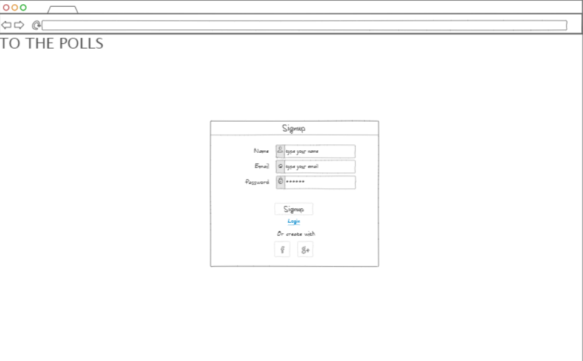
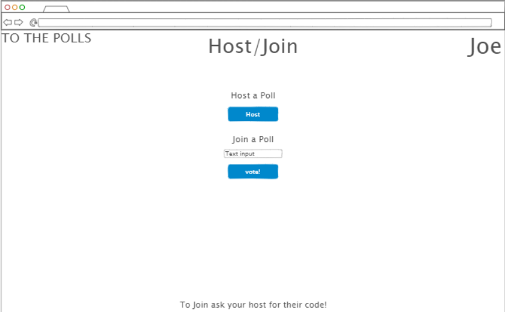
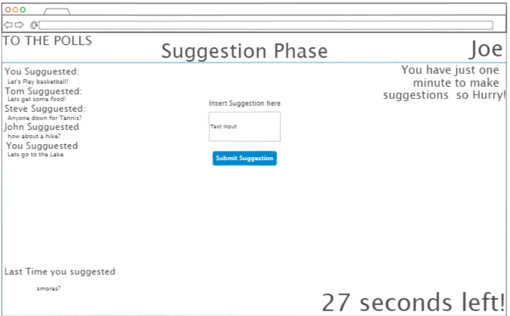
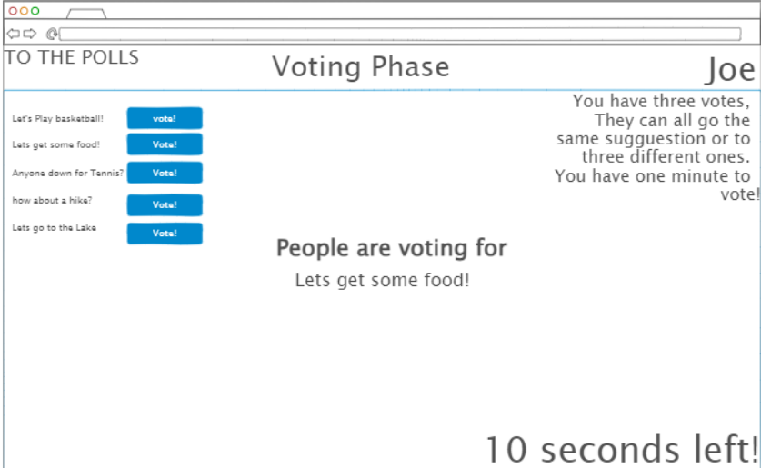

# startup
Repository for CS 260 website
## Elevator Pitch
	Have you ever had some friends together and tried to decide on what to do?  
    How about when you are with your family trying to decide where to go to eat?   
    It can be tough to decide on a choice that makes everyone happy,  
    especially when there’s a big group. So why not take a quick vote on it!  
    With this startup the decision can be made in just a few minutes.

## Technologies
- HTML- HTML will provide the general structure of the site including the different pages
- CSS- CSS will make this website look sleek and easy to understand
- JavaScript- JavaScript will provide the interactivity of the site, making the buttons actually do something 
- Web services – Will provide the ability to see other people’s suggestions as they are provided
- Authentication- Each user will be prompted to create an account or login when they land on the page
- Database Data- For each user their past suggestions will be saved and presented
- WebSocket Data – will allow you to see the most popular suggestion that the most people are currently voting for
- Web framework- when the time comes react will be implemented
## Renderings

